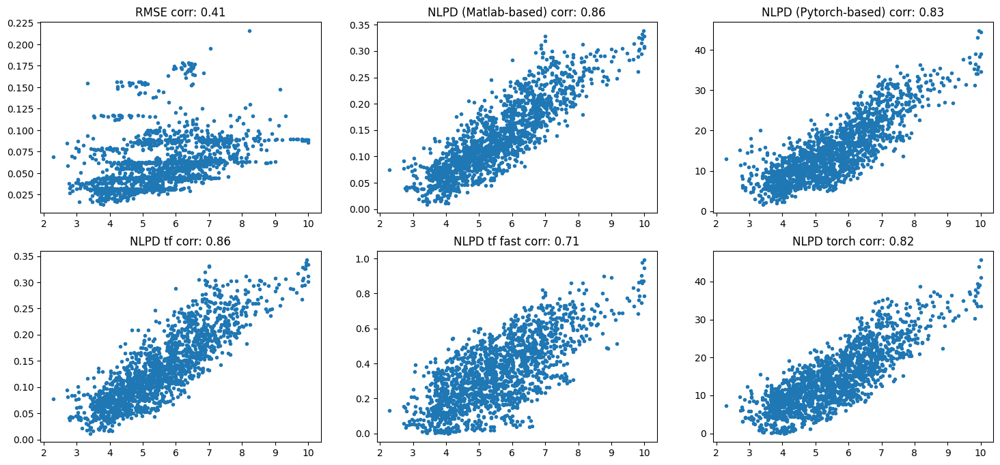

# NLPD IQA

In this repository different implementations of the Normalized Laplacian Pyramid Distance (NLPD) are shared and linked: 

**TLDR:** 

· If you only need to evaluate it in regular images, use 'NLPdist_RGB'. 

· If you need to evaluate it using calibrated images (in cd/m2), use 'NLPdist_lum'. 

· If you need to optimize it, use the the Tensorflow or the PyTorch versions. 

· In the following jupyter notebook there is an example of how to use all of them, and how to test them in TID2008. Different implementations have a slightly different behavior:

NLPD_versions_comparisons_TID2008.ipynb

 

## BIBLIOGRAPHY

[1] **First Publication.** NLPD for IQA (simple fitted by-hand weights):

Perceptual image quality assessment using a normalized Laplacian pyramid. 
V Laparra, J Ballé, A Berardino and EP Simoncelli. 
HVEI: SPIE, Conf. on Human Vision and Electronic Imaging, XXI, (2016)

https://www.uv.es/lapeva/papers/2016_HVEI.pdf

[2] **First Paper.** Slightly different implementation, and weights fitteg by backprop. Implemented to deal with inputs in cd/m2 and used for rendering:

Perceptually Optimized Image Rendering. 
V. Laparra, A. Berardino, J Ballé and E. P. Simoncelli 
Journal of the Optical Society of America A, (2017)

https://arxiv.org/abs/1701.06641

*CODE* -ORIGINAL- (implementations in Theano and in Matlab):

http://che.uv.es/public/POIR/Perceptual_Rendering.html

*CODE* in this repository (only using numpy and scipy):

· 'NLPdist_lum' deals with cd/m2. Matlab-based implementation. 
· 'NLPdist_RGB' deals with RGB images (in [0-1] range). Matlab-based implementation. 
· 'NLPD' deals with RGB (in [0-255] range). This is a PyTorch-based (Alex Hepburn version) implementation.  

*CODE* by Jona Ballé (implementation in Tensorflow):

https://github.com/google-research/perceptual-quality

[3] **Using NLPD for GANs regularization:**

Enforcing Perceptual Consistency on Generative Adversarial Networks by Using the Normalised Laplacian Pyramid Distance 
A. Hepburn, V. Laparra, R. McConville, R. Santos-Rodriguez 
NLDL: Proceedings of the Northern Lights Deep Learning (2020)

*CODE* by Alex Hepburn (implementation in PyTorch): 
https://github.com/alexhepburn/normalised_laplacian_pyramid

*CODE* by Valero Laparra (Alex fork): 
https://github.com/Valerolaparra/NLPD_Pytorch

